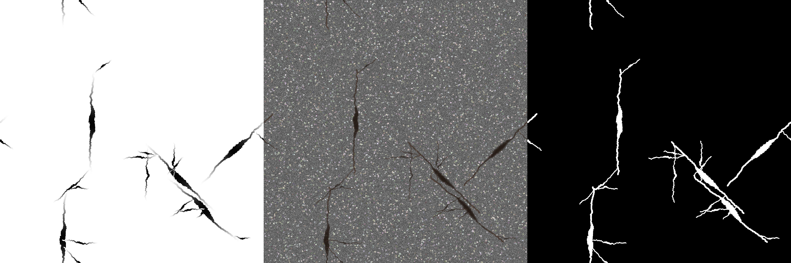
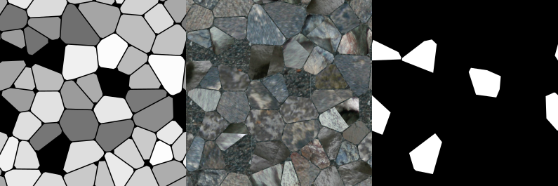

Ground Modules
==============

The ground rendering functions are called toward the beginning of the blender
model setup, and render out image files that are then loaded as textures in
the scene being set up.

Two kinds of ground generation methods are provided, *asphalt* and *voronoi
stones*.
    
Asphalt
-------

Example depth-, texture- and defects image respectively. Note the tiling
property.

The asphalt module provides the function :py:meth:`grounds.asphalt.generate_asphalt` which
renders the three different versions of the asphalt ground type:

    * Depth
    * Texture
    * Defects

The brightness of the asphalt texture will vary randomly, but not greatly.
This is done in the hopes of providing more varied input to the neural net
being trained.

.. automodule:: grounds.asphalt
    :members:

Voronoi
-------

Examples from the voronoi module with slightly more irregular stones.

The voronoi module generates stone grounds with the help of Voronoi graphs and
SVG vector graphics. The SVGs are then converted to PNGs. Voronoi graphs are
used to render both the *cobblestone* and *slate* ground types.

Renderer
^^^^^^^^

.. automodule:: grounds.voronoi.renderer
    :members:

Voronoi Grid
^^^^^^^^^^^^

.. automodule:: grounds.voronoi.voronoi
    :members:

SVG Rendering
^^^^^^^^^^^^^

.. automodule:: grounds.voronoi.svg
    :members:
